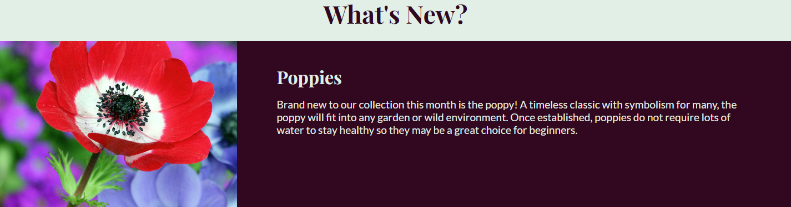

# Shoots & Seeds
The main goal of this website is to market the imagined business: 'Shoots & Seeds', a new retailer of plants and seeds. The site intends to educate new users about the business in a simple and endearing way and also have use for returning users as well. Shoots & Seeds will be valuable to users as it provides updates on new stock, allows users to enter a monthly competition and provides links to various social outlets.

## Contents
-[UX](#ux)  
-[Design](#design)  
-[Features](#features)  
-[Technologies Used](#technologies-used)  
-[Deployment](#deployment)  
-[Testing](#testing)  
-[Credits](#credits)  

## UX
### User Stories:  
  -The goal of this site for new users is to market the business in a non-obtrusive and enjoyable way. New users should quickly be able to know how to navigate the pages and absorb all of the content efficiently. They should learn some basics about Shoots & Seeds and also the opening times. Additionally, first-time users should be intrigued by the monthly new stock and competition and desire to return to the website at a later date.  
  -Returning users should be able to navigate the pages of the site quickly and see what new stock is available each month. Each section of the "what's new?" page should be informative and promote the stock to the user. Frequent users are also encouraged to provide feedback and enter the monthly competition via the "competition" page. The form should be simple and effective to increase the chances of user interaction.

## Design
### Colour Scheme and Imagery:

Above is the colour scheme for the Shoots & Seeds website, courtesy of [Coolors](https://coolors.co/).  

For this site, I wanted a colour scheme which connoted plants and flowers that also provided multiple high-contrast pairings. For example: Amber and Blue Sapphire, and Honeydew and Dark Purple. Dartmouth green provides a backdrop for the rest of the colours to visually pop a little more and I think also helps the site feel a bit more cozy and inviting. All of the imagery used on the site contains shades of pink or green in reference to the scheme to create cohesion and to make sure the images don't stand out for the wrong reasons.

### Typography:
  
Above is a depiction of the fonts used on the website: "Playfair Display" and "Lato", courtesy of [Google Fonts](https://fonts.google.com/about) and [Fontpair](https://www.fontpair.co/all).  

Playfair Display is the font used for all of the site headers, I liked this font for this website because it feels very organic and natural in a way that reminds me of plants and vines. It also has enough quirkiness to be appealing without being difficult to read. I paired this with Lato because the fonts convene nicely in a non-disturbing way. I also like Lato because it is simple which makes it easier to read and ensures that is doesn't distract from the already bold Playfair Display.

## Features
### Header
  

The header of the website features the main logo on the left and the navigation links to all of the pages of the website on the right. The logo also links back to the home page. Both the logo and all of the links provide feedback to the user when hovered over by changing colour. The header is valuable to the user because it provides intuitive navigation.  

### Hero Image
  

The hero image provides the first impression to the user upon launching the site. I made the text large so that it would be memorable and encourage the user to explore the rest of the site. The hero image is valuable to the user because it creates an impression and compels the user to interact with the rest of site.  

### About Us Section
  

The about us section is divided into 3 sub-sections so that the information is less imposing and easier to digest for the user. The text and background colour provide high-contrast for ease of reading and I also used some [font awesome](https://fontawesome.com/) icons alongside the three sub-section titles to add some visual appeal. The about us section is valuable to the user because it provides all the information a user would like to know about Shoots & Seeds in a visually interesting way.   

### Open Times Section
  

The open times section features a table that shows the user the open times of the Shoots & Seeds stores. The left and right thirds of the section contain filler images to keep the user interested and also continue the three column style of the about us section. I changed the background-color of this section to colour block the sections and give the user a sense of progression through the site. The color of the text is also changed accordingly to maintain high-contrast.  This section is valuable to the user because it uses images to break up too much text and lets them know what times Shoots & Seeds is open.  

### Footer
  

The background and text colour of the footer is the reverse of the background and text color of the main body to create consistency but also divide the sections. Inside the footer is links to various social media platforms in the form of more [font awesome](https://fontawesome.com/) icons. These links open in a new tab when followed. The footer is valuable to the user because it allows them to interact with the business on different platforms and tells them that they have reached the end of the page.  

### What's New Page
  

The "What's New?" page contains an image and some descriptive text for each of the new plants available each month. I colour blocked the different sections to the make the page more intuitive for new users. This section adds value to the site for returning users as well as new users because it can be updated when needed.

### Competiton Form
  

The competition form contains a small description, a text input, an email input, 3 radio buttons, a textarea input, and a submit button. This allows the user to learn what the monthly competiton is about and enter if they would like to. This section is valuable for users because it lets them provide their own feedback and develop the relationship between them and the business. It also increases interactivity with returning users.  

### Future Implementations:
-One feature that I would like to add to the site in the future is an iframe for google maps which shows the location of Shoots & Seeds stores. This would fit nicely between the open times section and the footer on the home page. This feature was in my initial scope for this website however, it never reached this version becuase I didn't feel as though I possessed the required knowledge to implement it in a style consistent with the rest of the site. I decided to leave this feature for future version once I felt I could implement it in a way that allowed it to shine on the page.  

-Another feature I would like to implement in the future is a gallery of user-submitted images. The gallery would be it's own new page and would display the best user pictures on a weekly/monthly rotation. The page would include a small and seamless form that allowed the user to submit their own imagery. A simplified version of this feature was my initial design for the current competition form but I found that I lacked the experience to create a form that allowed users to submit their images in a neat way.  

## Technologies Used

## Deployment

## Testing

## Credits
