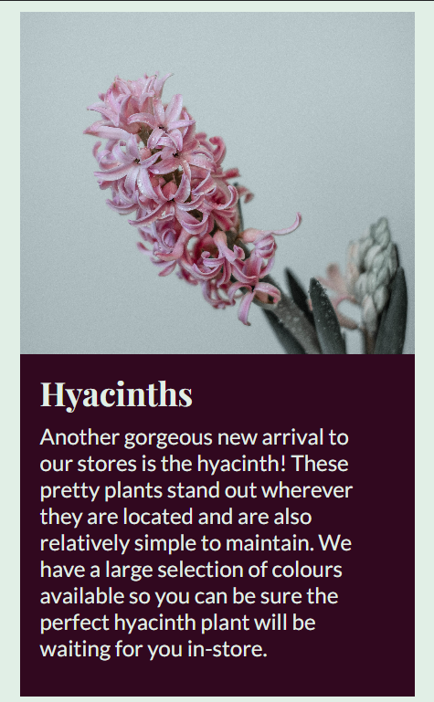

# Shoots & Seeds Testing
## Automated Testing  
- All of the HTML written for this site passes through the [W3C HTML Validator](https://validator.w3.org/) with no errors.
- All of the CSS written for this site passes through the [W3C CSS Validator](https://jigsaw.w3.org/css-validator/) with no errors.  

Home page Lighthouse:  
  

What's New? page Lighthouse:  
  

Competition page Lighthouse:  
  

The main reason for the low performance score on the home page is large image sizes. I will resolve this issue in a future version by either condensing the image files someway or replacing them with smaller versions.  

## Manual Testing 
### Functionality:
| Test Label | Test Action | Expected Outcome | Test Outcome |
|------------|-------------|------------------|--------------|
| Internal links function correctly. | Click all navigation links on every page. | All links should navigate where expected. | PASS |
| External links function correctly. | Click all social media links in the footer. | All links should navigate where expected and open in a new tab. | PASS |
| Form functions correctly. | Attempt to submit form with different fields empty. | The form should only submit with all required fields filled correctly. | PASS |

### Browser Compatibility:
This website works as intended on the following browsers:
- Google Chrome
- Microsoft Edge
- Mozilla Firefox

### Responsiveness:
320px Screen Responsiveness:  
  

4K screen Responsiveness:  
  

## Bugs
### Solved Bugs:
- There was an issue with the footer loading halfway up the home page instead of at the bottom. I fixed this issue by giving the html file a min-height of 100% and a position of relative and giving the footer an absolute position of bottom:0 and left:0.

### Known Bugs:
- There are no current bugs as far as I am aware.

Return to [README](README.md)