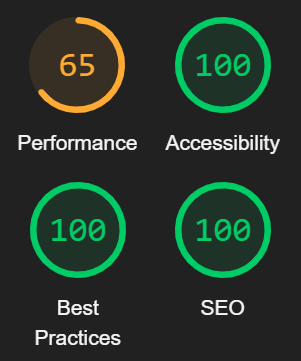
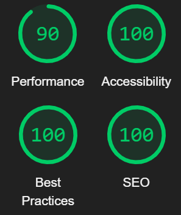
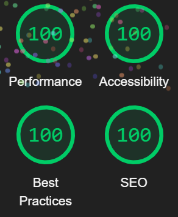

# Shoots & Seeds Testing
## Automated Testing  
- All of the HTML written for this site passes through the [W3C HTML Validator](https://validator.w3.org/) with no errors.
- All of the CSS written for this site passes through the [W3C CSS Validator](https://jigsaw.w3.org/css-validator/) with no errors.  

Home page Lighthouse:  
  

What's New? page Lighthouse:  
  

Competition page Lighthouse:  
  

The main reason for the low performance score on the home page is large image sizes. I will resolve this issue in a future version by either condensing the image files someway or replacing them with smaller versions.  

## Manual Testing 
